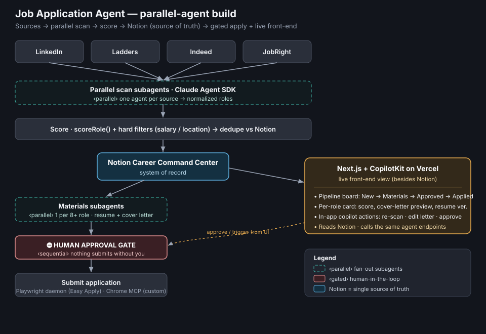

# Handoff — Job Application Agent: parallel agents + CopilotKit front-end

**Date:** 2026-06-02 · **Owner:** Sav Banerjee (sav@ensopartners.co) · **Repo:** github.com/nycsav/job-application-agent (⚠️ currently PUBLIC)

This doc is a clean starting point for a **new thread**. It captures where things stand today, the honest current process, the target architecture, an agent-terminology primer, and concrete next steps. No re-derivation needed.

---

## 0. Architecture (target)

*If the SVG doesn't render in your viewer, open `docs/job-agent-architecture.svg` directly.*

**Read it as:** 4 sources → **parallel scan subagents** (fan-out) → score + dedupe → **Notion = single source of truth** → two branches: (A) **gated** materials + submit, (B) **Next.js + CopilotKit on Vercel** as a live front-end that reads Notion and calls the same agent endpoints.

---

## 1. Status snapshot (end of 2026-06-02)

- **Morning scan ran.** 4 new roles staged to Notion as *Materials Ready*: Capital One (Lead AI Engineer, Agentic), JPMorgan (AI Modeling Lead), Optum (Sr Director AI/ML), StaffRight (Sr Dev Agentic AI). Two same-day dupes skipped (Citi, Photon). An earlier 12:07 run also staged ~8 "Director/Head" roles.
- **New sources registered** in `CLAUDE.md`: **Source 5 — JobRight** (personal Gmail, `eric@jobright.com`), **Source 6 — Ladders** (`jobs@my.theladders.com`, ensopartners.co inbox).
- **Committed locally** (`55500a6`): all previously-uncommitted agent/config changes + the two sources + a hardened `.gitignore`. **NOT pushed** (no GitHub creds in Cowork sandbox; see Risks).
- **`.gitignore` hardened** to keep resumes, `.secrets/`, logs, the xlsx tracker, and root `*.docx` out of the public repo.

## 2. Current process (honest — not yet autonomous)

1. **Scan** — Cowork MCPs (Dice/"LinkedIn" job MCP + Gmail) **and** the repo's own personal-Gmail bridge `agents/personal-gmail-scanner.mjs` (direct OAuth2 to sav.banerjee@gmail.com, `--from` flag).
2. **Score** — `scoreRole()` in `agents/scanner.mjs`: title (0-3), skill (0-3), industry (0-2), location (0-1), comp (0-1); hard filters (salary ≥ $180K FTE, NYC/remote) run **before** scoring.
3. **Stage** — write to **Notion Career Command Center**. This morning via the Notion MCP (`notion-create-pages`); repo also has `lib/notion-writer.mjs`.
4. **Apply** — two mechanisms, **both behind a mandatory human gate**: (a) headless **Playwright daemon** `daemon/easy-apply-bot.mjs` (launchd) for Easy Apply; (b) **Chrome connector / `agents/submitter.mjs`** for Greenhouse/Ashby/Lever forms. "Terminal + Claude + Chrome to apply" = gated form-fill, **not** code deployment. **Daemon appears stopped since 2026-05-29.**

## 3. Target build — methodology

**A. Parallelize the scan.** Replace the sequential source loop with **parallel scan subagents** — one per source (LinkedIn, Ladders, Indeed, JobRight), each returning a normalized role list. Fan-in → shared `scoreRole()` → dedupe vs Notion. (Today this can run via the Cowork Task/Agent tool; in production via the Agent SDK or Managed Agents — see §5.)

**B. Keep Notion as the source of truth.** All dedupe/status/materials links stay in the Career Command Center DB. Nothing downstream becomes a second source of record.

**C. Parallel materials.** For each 8+ role, spawn a materials subagent (resume routing via `config/resume_map.json` + cover letter). These run concurrently.

**D. Submission stays sequential + human-gated.** Unchanged safety posture.

## 4. Front-end (besides Notion) — CopilotKit + Next.js on Vercel

- **Stack:** Next.js (App Router) on Vercel; **CopilotKit** for the in-app AI sidebar; Notion API as the data source (read).
- **Views:** pipeline board (New → Scoring → Materials Ready → Approved → Applied); per-role card with score, cover-letter preview, resume version, and an Apply button (human gate).
- **CopilotKit actions** (the copilot can call): `rescanSources`, `rescoreRole`, `draftCoverLetter`, `approveSubmission`. Each maps to a Vercel serverless function that calls the agent layer.
- **Reuse what already works:** the **Signal Lens** demo proved the *Vercel + Claude serverless* pattern in this exact account (`nycsav`). Same deploy shape, pointed at job data. (Signal Lens is a *different product* — don't merge codebases.)
- **Pattern split:** Agent SDK in serverless for latency-sensitive UI actions; Managed Agents for the scheduled background scan.

## 5. Primer — sub-agents vs parallel agents vs managed agents (and what's newest)

| Term | What it is | Where it runs |
|---|---|---|
| **Sub-agents** | Reusable agent *configs* (YAML: custom prompt + scoped tools) the main agent spawns to isolate context for a focused subtask. The building block. | Inside one session, your infra |
| **Parallel / background agents** | A *pattern*, not a product: many independent sessions running at once (monitored via "Agent view"); "agent teams" = sessions that message each other. **Cost note:** each parallel agent burns its own isolated context → token spend multiplies. | Your infra |
| **Managed Agents** | Anthropic-**hosted** agent infrastructure (REST API): Anthropic runs the agent loop, per-session sandbox, session state, scoped permissions, tracing. ~$0.08/session-hour + token rates. | Anthropic-hosted |

**Most advanced / latest:** **Managed Agents** — launched **April 2026**, with **Multi-Agent Orchestration** added **May 2026** (a lead agent delegates to specialist sub-agents, each with its own model/prompt/tools, running in parallel on a shared filesystem; Netflix is an early deployer). Also added May 2026: *Dreaming* (scheduled memory curation) and *Outcomes* (learning from past sessions). So: **sub-agents = the unit, parallel/background = the pattern, Managed Agents = the hosted platform that productionizes both — and is the newest, most advanced layer.**

**Recommendation for this project:** use **Managed Agents Multi-Agent Orchestration** for the daily background scan (lead + 4 source specialists in parallel), and the **Agent SDK** inside Vercel for the interactive CopilotKit actions.

### DECISION (2026-06-02): Managed Agents = the destination, reached in 2 phases

Sav chose Managed Agents as the target runtime. Honest framing recorded so the new thread doesn't over-rely on it: **Managed Agents improves operational reliability (runs daily hands-off, retries, session persistence, Dreaming/Outcomes learning) — it does NOT improve application quality, which is runtime-agnostic.** Therefore:

- **Phase 1 — prove it cheap.** Build the full pipeline (parallel scan → `scoreRole()` → resume routing → gated apply) on the **Cowork scheduled task + Agent SDK**. No per-session fee while iterating. Goal: a reliable, correct daily run.
- **Phase 2 — promote to Managed Agents.** Once proven, move the daily background scan to **Managed Agents Multi-Agent Orchestration** (lead + 4 source specialists). This is where the **~$0.08/session-hour + token** billing begins. Keep the front-end copilot + the human-gated submit on the **Agent SDK** in Vercel (token-only).

**Cost note:** the Cowork-plan scan has no separate API bill; the Agent SDK app bills tokens only; Managed Agents adds the session-hour fee. Confirm the current $0.08 rate on the Claude pricing page before Phase 2.

## 6. Open risks / cleanup (from today's audit)

1. **Make the repo PRIVATE before pushing.** `CLAUDE.md` (already public) names real clients (Gore, Citi, JPMorgan, AmEx, Pfizer, Eli Lilly) + internal IDs. 2 clicks: GitHub → Settings → Danger Zone → Change visibility.
2. **Push the local commit** (`55500a6`) once private — needs GitHub creds (run from Sav's Mac, not the sandbox).
3. **Daemon stopped since 2026-05-29** — confirm/restart launchd on the Mac; fix the `briefing drafted: undefined` bug.
4. **Dual tracker drift** — daemon → Google Sheet, Cowork runs → Notion. Decision: make **Notion** canonical, retire the Sheet path.
5. **Stale `.git/index.lock`** — couldn't delete from the sandbox (macOS mount perms); self-heals on next normal git op on the Mac.
6. **JobRight automation** — needs the personal-Gmail bridge creds (gitignored, Mac-only); currently read off a screenshot.

## 7. Key IDs / paths

- Notion DB: `8ce2a0e3-0ab3-4416-bcfe-81295f4e4991` · data source `931eceb1-d35d-46ca-9d4a-7fbfa48d3f99`
- Repo: `~/Documents/Claude/Projects/Job-Application-Agent` · scoring in `agents/scanner.mjs` · resume routing in `config/resume_map.json`
- Drive (separate Enso *hiring* artifact, not this pipeline): "ENSO JOB DESCRIPTION" / `Junior_Data_Analyst_Role.docx`

## 8. First moves for the new thread

1. Confirm repo is **private**, then push `55500a6`.
2. Scaffold the Next.js + CopilotKit app in a **new folder** (not in this repo unless decided), wired to the Notion DB above (read-only first).
3. Stand up one **parallel scan** proof: lead agent + 2 source specialists, fan-in to `scoreRole()`.
4. Pick canonical tracker (recommend Notion) and retire the Sheet write.
