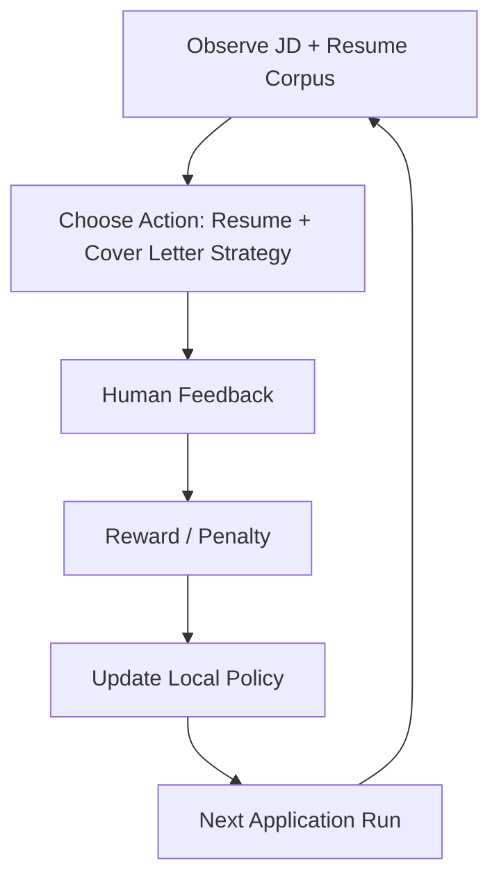

# Codex Run Learnings: 2026-06-04

This note captures what worked, what did not, where the agent got stuck, and the policy updates for the next application run.

## Scope

- Reviewed and extended the `Codex` branch of the local job application agent.
- Used LinkedIn, local resume files, Gmail scanning logic, and the local repo workflow.
- Staged a LinkedIn Easy Apply flow for SoftServe's Agentic Solution Principal role, but did not submit.
- Added a resume/JD matching gate and Gmail inbox cleanup behavior.

## What Worked

- The local-first branch structure was the right direction. It kept the original source folder untouched and made the `Codex` branch the active build area.
- Browser automation could reach LinkedIn saved jobs and stage an application far enough to inspect the final review state.
- Local resume files were available and usable as the trusted source of truth.
- Extracting `.docx` text locally worked without sending resume files to another system.
- The resume/JD matcher correctly selected `Forward Deployed AI Architect` for SoftServe after adding concept-level matching.
- The human approval gate prevented accidental submission.
- The Gmail cleanup design is now clear: processed job emails move to `Codex Job Applications` and leave the Inbox.
- Tests remained fast and useful as guardrails after each change.

## What Did Not Work

- I moved too quickly into the LinkedIn application flow before asking for the resume and cover-letter strategy.
- The first resume matcher was too literal. It matched exact phrases but missed equivalent evidence such as "architect", "client", and "delivery" when the JD said "solution principal" or "client stakeholders".
- The initial Gmail implementation was read-only, so it could not archive or label processed emails.
- Browser extraction and email review were useful but not enough on their own. The agent needs local resume analysis before any application decision.
- The personal Gmail account was not accessible in the browser session, so direct review of both inboxes was incomplete.
- The first scoring pass let the PMM resume score too high because keyword overlap was not balanced by resume archetype fit.

## Where I Got Stuck

- OAuth scope mismatch: Gmail scanning used `gmail.readonly`, but inbox cleanup requires `gmail.modify`.
- Browser state was fragile because the LinkedIn application modal was already in progress while the workflow policy was still being clarified.
- Local generated job inputs and reports are intentionally ignored, which is correct for privacy but requires the agent to summarize findings clearly.
- "Apply for 3 jobs in 30 minutes" conflicted with the need for careful resume selection, tailored cover letters, and final human confirmation.
- The word "reinforcement learning" needed translation into an implementable local feedback loop rather than a claim that the agent trained a model.

## Reward Signals

Positive reward:

- The agent extracts and scores the JD before selecting a resume.
- The agent reads actual resume contents before deciding which version to use.
- The agent asks for cover-letter direction before writing or submitting.
- The agent reaches the final application review state without clicking final submit.
- The agent records decisions, artifacts, and email provenance in local state.
- The agent cleans processed job emails from the Inbox after extraction.

Negative reward:

- The agent fills or uploads materials before explaining the resume choice.
- The agent relies only on browser-visible application defaults.
- The agent treats exact keyword overlap as sufficient evidence.
- The agent ignores tailoring gaps that appear in the JD.
- The agent lets processed job emails remain in the Inbox.
- The agent attempts final submit without action-time confirmation.

## Policy Updates For Next Application

1. Extract the full JD first.
2. Run `npm run codex:resume-match -- --job-json <job.json>` before selecting materials.
3. Present the recommended resume, runner-up, rationale, and tailoring gaps.
4. Ask for cover-letter direction before generating text.
5. Generate or select materials only after the resume strategy is accepted.
6. Use browser automation to fill forms only after materials are approved.
7. Stop at the final review screen and ask for explicit confirmation before submission.
8. After processing job-alert emails, apply `Codex Job Applications` and remove `INBOX`.
9. Log all skips, stuck states, and final decisions in the local ledger.

## Next-Run Application Checklist

- Confirm browser is on the correct job page.
- Capture title, company, location, compensation, JD, and apply URL.
- Run hard filters and duplicate checks.
- Run resume/JD matcher against all local resume versions.
- Summarize match report in plain English.
- Ask for cover-letter positioning: technical principal, executive transformation, forward-deployed builder, or another user-provided direction.
- Draft cover letter from the selected resume and JD gaps.
- Fill application fields.
- Pause at final review.
- Submit only after explicit user approval.
- Save confirmation and archive processed source emails.

## Practical Learning Loop

This is not formal model training. It is a local feedback loop:

The immediate policy improvement is to reward careful sequencing: JD extraction, resume matching, human positioning, material generation, form fill, final approval, and only then submission.
