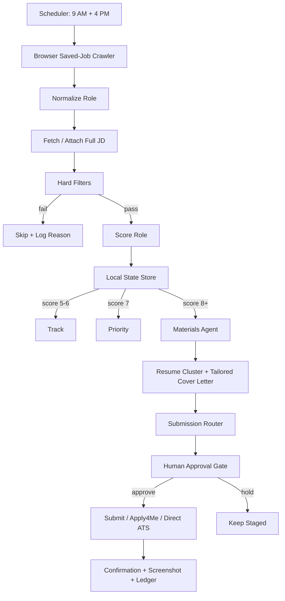

# Codex Branch: Local-First Job Agent Architecture

This branch keeps the original project as reference material and builds a simpler local-first workflow in this workspace.

## Working Shape

## Simplification Points

- One canonical role object for every source.
- One local state ledger before any external sync.
- One policy file for filters, scoring thresholds, and submission routing.
- One materials path that starts from trusted local resume clusters.
- One submission router that decides Apply4Me, direct ATS, or manual assist.
- Browser automation is used only after the role passes filters and scoring.
- Human approval is a required state transition, not a loose instruction.

## New Entry Points

- `npm run codex:pipeline -- --fixture reports/parallel-scan-fixture.json`
- `npm run codex:pipeline` after adding `input/saved-jobs.json` or `input/saved-jobs.csv`
- `npm run codex:test`
- `npm run codex:resume-match -- --job-json input/<job>.json`

The first implementation pass is stage-only. It scores roles, generates local material manifests, routes submissions, and writes the local ledger. Browser crawling and final submission hooks plug into this spine next.

## Learning Loop

- Run reflection: `docs/CODEX-RUN-LEARNINGS-2026-06-04.md`
- Machine-readable policy: `config/codex-learning-policy.json`

The current feedback policy rewards the sequence: extract JD, compare actual resume text, explain the resume choice, ask for cover-letter positioning, fill only after approval, stop at final review, and archive processed source emails.

## Strategic Archetype Scoring

Approved target archetypes live in `config/codex-role-archetypes.json` and are used by `lib/codex-archetypes.mjs`.

| Archetype | Priority | Resume Route |
| --- | --- | --- |
| Forward-Deployed AI Strategist / Solution Principal | Highest | Forward-Deployed AI Architect |
| VP / Director AI Transformation | Highest | AI Advisory, with MD Managed Services as secondary |
| Lead AI Consultant / Principal AI Advisor | Highest | AI Advisory |
| Agentic AI Platform / AI Solutions Architect | High | Forward-Deployed AI Architect |
| AI CoE / Managed Services / Implementation Partner | High | MD Managed Services |
| AI Product Strategy / GTM / Partnerships | Medium-High | PMM / GTM |

The role scorer now returns the best archetype, strategic-fit band, top archetype matches, and the normal 0-10 score. Resume routing uses the winning archetype before falling back to generic keyword rules.
