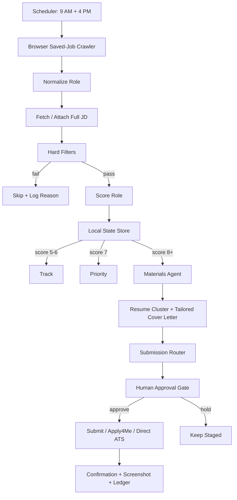

# Codex Branch: Local-First Job Agent Architecture

This branch keeps the original project as reference material and builds a simpler local-first workflow in this workspace.

## Working Shape

## Simplification Points

- One canonical role object for every source.
- One local state ledger before any external sync.
- One policy file for filters, scoring thresholds, and submission routing.
- One materials path that starts from trusted local resume clusters.
- One submission router that decides Apply4Me, direct ATS, or manual assist.
- Browser automation is used only after the role passes filters and scoring.
- Human approval is a required state transition, not a loose instruction.

## New Entry Points

- `npm run codex:pipeline -- --fixture reports/parallel-scan-fixture.json`
- `npm run codex:pipeline` after adding `input/saved-jobs.json` or `input/saved-jobs.csv`
- `npm run codex:test`

The first implementation pass is stage-only. It scores roles, generates local material manifests, routes submissions, and writes the local ledger. Browser crawling and final submission hooks plug into this spine next.
